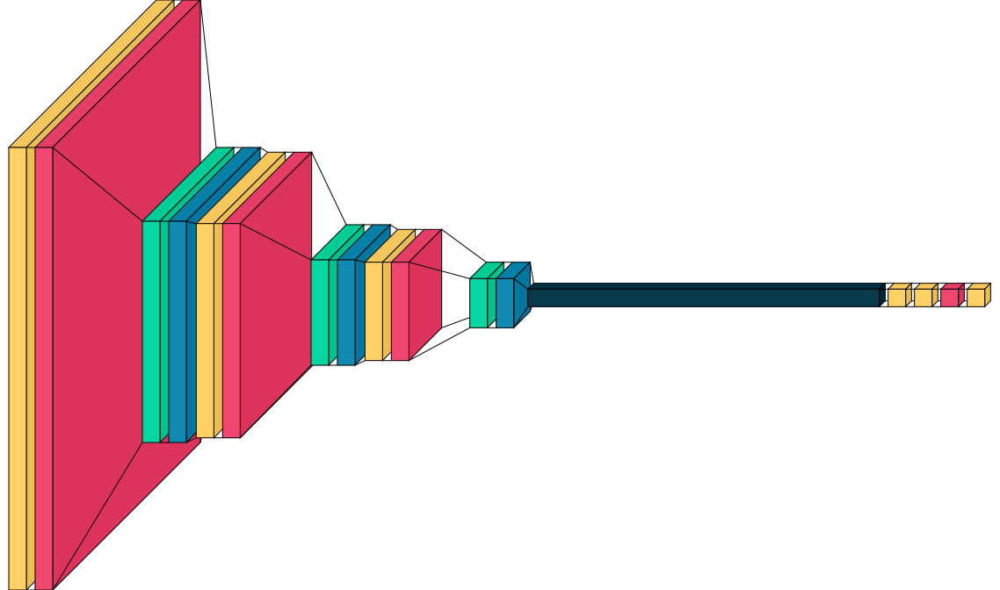

# SRIP-24
## This is the Submission for the Selection Task of the Project - *ML for Sustainability: Satellite Data Processing for Detecting Pollution Sources*
### A. Dataset Preparation: 
  The dataset contained the total number of 90 classes where each class possessed image samples of the animal which the class is comprised.
  Moreover, the first task was to organize the Dataset of 90 classes into a One vs Rest dataset for the purpose of Binary Classification.                           
  Here, One vs Rest is a type of multiclass classification schemes built on top of real-valued binary classifiers is to train N different binary classifiers, each one trained to distinguish the examples in a single class from the examples in all remaining classes [^1]

  Secondly, the next task was to organize the Dataset of 90 total classes into 5 condensed classes, where the 90 class classification problem would be turned into 5 class classification problem.

  All of this was done with the help of [dataset_controller](dataset_controller.ipynb), where the 90 classes were organised for One vs Rest classification which created a binary classification problem for all the 90 different classes, where the primary class consisted the image samples of the animal the folder is comprised of while the other class contained all the other images samples of the remaining 89 classes. Upon further analysis, it is found that the primary class would only possess 60 image samples whereas the other(rest) class have 5340 image samples, This creates a huge class imbalance [^2]
Hence, to solve the problem of class imbalance, I augmented the samples of Primary class 30 times. i.e For every sample we create 30 different augmented sample, this artificially increases the samples approximately to 1800. At the same time, we select 20 samples from each remaining class so that we have somewhat equal amount of training samples in both the 'Primary' and 'rest' class.

Furthermore, I decided to have different ecological niche like Terrestrial, Aquatic, Aerial, Arboreal and Burrowing as the Classification Schema for condensing and organizing 90 different classes into 5 classes[^3]

### B. Model Development:
  Here, the input shape is set to be (128,128) and 3 color channels. Further, the samples are loaded with a Batch size of 32, the Learning rate is set to 1e-3. Also, the model is compiled with the 'adam' optimizer and categorical_crossentropy as the classification loss.

The model consists of 3 Convolution layers followed by 3 Fully Connected dense layers as classifier. The Convolution layers have activation function as 'Relu' (Rectified Linear Unit). Morevoer the last dense layer possesses 'softmax' as activation function. Each Convolution layer consists of a Maxpooling2D and BatchNormalization followed by a Dropout layer(p = 0.25)

  [^1]: [Rifkin, Ryan & Klautau, Aldebaro. (2004). In Defense of One-Vs-All Classification. Journal of Machine Learning Research. 5. 101-141.](https://www.researchgate.net/publication/220320940_In_Defense_of_One-Vs-All_Classification)
  [^2]: [Johnson, J.M., Khoshgoftaar, T.M. Survey on deep learning with class imbalance. J Big Data 6, 27 (2019).](https://doi.org/10.1186/s40537-019-0192-5)
  [^3]: [A Comprehensive Guide to Classifying and Understanding Animal Anatomy, Habitats, Communication, Behavior and Survival Strategies](https://www.scribd.com/document/246340404/Classification-of-Animals-Based-on-Their-Habitat) 

